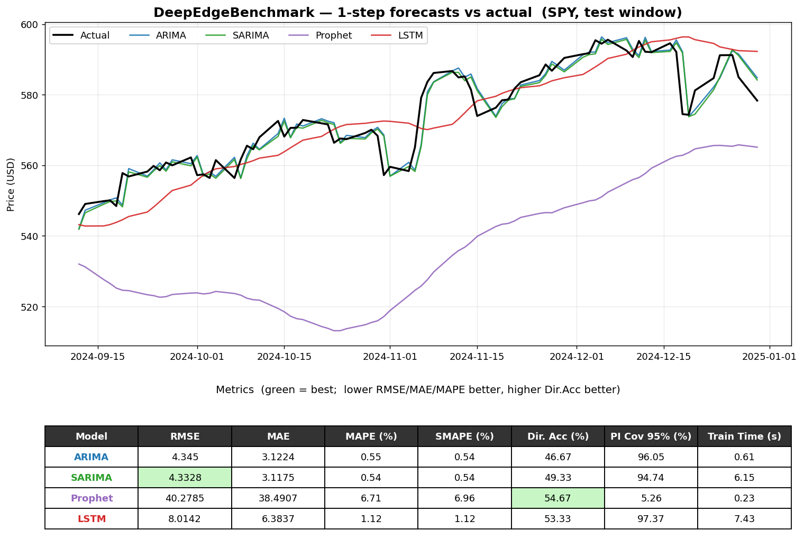

# DeepEdgeBenchmark
Coding Benchmark

## Models

All model, benchmark and orchestration scripts below live under
[`benchmarks/`](benchmarks/) (moved out of the repo root for tidiness — the
split between "reusable models" and "one-off benchmark iterations" may
change later).

| File | Description |
|------|-------------|
| [`benchmarks/arima_model.py`](benchmarks/arima_model.py) | ARIMA(2,0,2)-GARCH(1,1) forecaster on log-returns, walk-forward 1-step backtest. |
| [`benchmarks/sarima_model.py`](benchmarks/sarima_model.py) | Seasonal ARIMA(1,1,1)(1,0,1)[5] on prices, walk-forward 1-step backtest. |
| [`benchmarks/prophet_model.py`](benchmarks/prophet_model.py) | Prophet additive regression (weekly + yearly seasonality), fit-once batch forecast. |
| [`benchmarks/lstm_model.py`](benchmarks/lstm_model.py) | LSTM(64) over a 30-step look-back window, walk-forward 1-step backtest. |

Each model file is self-contained and shares the same CLI
(`--ticker / --start / --end / --test-ratio / --next-step / --plot`).
The `requirements.txt` covers all of them.

### Visual comparison

[`benchmarks/run_benchmark.py`](benchmarks/run_benchmark.py) runs all four
models on one asset and renders a single figure: forecasts overlaid on the
actual price, plus a metrics table (best RMSE / Directional Accuracy
highlighted).

```bash
cd benchmarks
python run_benchmark.py                       # SPY, 2023-2024 (default)
python run_benchmark.py --ticker BTC-USD      # different asset
python run_benchmark.py --start 2020-01-01 --end 2024-12-31   # full window (slow)
```



---

## How to get the code from GitHub and run it locally

### Step 1 — Install the tools (one-time)

You need **git** and **Python 3.9+**.

- **macOS:** `brew install git python`
- **Windows:** `winget install Git.Git` and `winget install Python.Python.3.12`
- **Linux (Debian/Ubuntu):** `sudo apt install git python3 python3-venv python3-pip`

Verify:
```bash
git --version
python --version      # use python3 on macOS/Linux if python is missing
```

### Step 2 — Get the repository

You have write access, so authenticate with the GitHub CLI once (`gh auth login`,
choosing **HTTPS** + **login with a web browser**), then clone:

```bash
gh repo clone DarkShey/DeepEdgeBenchmark
cd DeepEdgeBenchmark
```

Plain git works too:
```bash
git clone https://github.com/DarkShey/DeepEdgeBenchmark.git
cd DeepEdgeBenchmark
```

**Already cloned earlier?** Just pull the latest before running:
```bash
git pull
```

> Need only one file without cloning? Download it directly from the raw URL:
> ```bash
> curl -O https://raw.githubusercontent.com/DarkShey/DeepEdgeBenchmark/main/benchmarks/arima_model.py
> ```
> (Private repo, so add `-H "Authorization: token $(gh auth token)"` if `curl` is denied.)

### Step 3 — Install the Python dependencies

Use a virtual environment so the project's packages stay isolated:

```bash
python -m venv .venv

# activate it:
source .venv/bin/activate        # macOS / Linux
.venv\Scripts\activate           # Windows (PowerShell)

pip install -r requirements.txt
```

(Run `deactivate` when you're done to leave the virtual environment.)

### Step 4 — Run the model

```bash
cd benchmarks
python arima_model.py                              # BTC-USD backtest, prints metrics
python arima_model.py --ticker SPY                 # different asset
python arima_model.py --ticker SPY --plot out.png  # + save a forecast plot
python arima_model.py --ticker GC=F --next-step    # single next-step forecast
python arima_model.py --help                       # all options
```

The script downloads price data from Yahoo Finance at runtime, so an internet
connection is required on the first run.

Expected output looks like:
```
=== ARIMA(2, 0, 2)-GARCH(1,1) — SPY ===
  RMSE              : 2.4562
  MAE               : 1.831
  Dir. Acc (%)      : 70.27
  PI Cov 95% (%)    : 100.0
  ...
```

### Troubleshooting

| Symptom | Fix |
|---------|-----|
| `python: command not found` | Use `python3` instead (macOS/Linux). |
| `ModuleNotFoundError` | Activate the venv and re-run `pip install -r requirements.txt`. |
| `No data returned for <ticker>` | Check the ticker spelling and that you're online. |
| `git pull` shows conflicts | You edited a tracked file — stash with `git stash` then `git pull`. |
